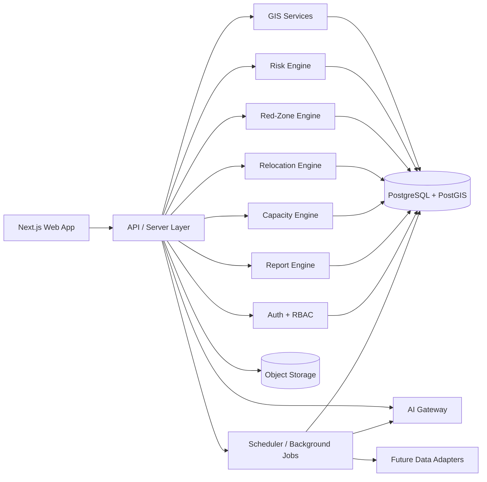
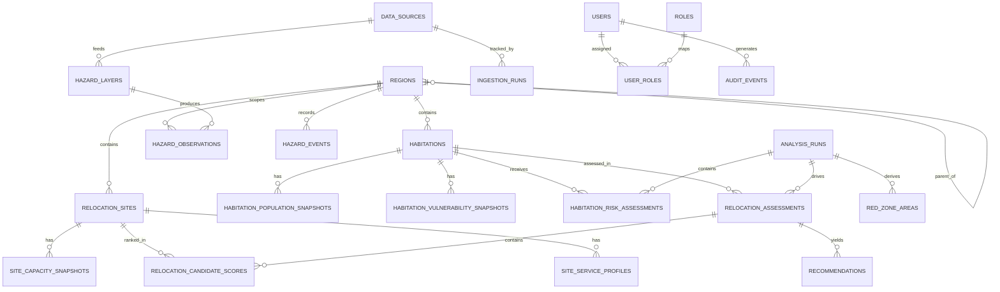

# SIH26191 Master Architecture Blueprint

Status: architecture baseline  
Date: 2026-08-26  
Project context: greenfield repository for Smart India Hackathon 2026  

## 1. Working Interpretation Framework

This document intentionally separates five different things:

1. **Official SIH26191 requirements**
   Only what is present in the problem statement:
   - dynamically identify and update multi-hazard Red Zones
   - assess carrying capacity of safer alternative sites
   - prioritize vulnerable habitations for relocation
   - integrate hazard intensity, population vulnerability, and disaster history
   - provide actionable insights for proactive planning

2. **Proposed implementation**
   Our architecture, scoring methods, modules, UX flows, and stack choices.

3. **Assumptions**
   Reasonable decisions needed to make the product buildable, but not stated by SIH.

4. **Demo/simulation data**
   Deterministic seeded data used for development and hackathon demonstrations.

5. **Potential future real data integrations**
   Designed as plug-in adapters and freshness-tracked sources, but not claimed as live unless actually connected.

## 2. Traceability Matrix

| SIH26191 statement | Platform capability | Classification |
| --- | --- | --- |
| Identify and update multi-hazard Red Zones | Red-zone engine, hazard overlays, refreshable hazard layers | Official requirement |
| Assess carrying capacity of safer alternative sites | Capacity engine, site assessment, limiting-factor calculations | Official requirement |
| Prioritize vulnerable habitations for relocation | Habitation prioritization engine, urgency bands, recommendation workflow | Official requirement |
| Integrate hazard intensity, population vulnerability, and disaster history | Risk engine with explainable weighted factors and evidence cards | Official requirement |
| Provide actionable insights for authorities | Dashboard, decision support, reports, audit trail, action plans | Official requirement |
| GIS-enabled decision support platform | Interactive map, layer controls, spatial queries, GeoJSON APIs | Official requirement |
| Real-time operation | Freshness-aware ingest architecture and simulation refresh loop | Proposed implementation |
| Alerts, reports, authentication, audit logs | Authority-grade operating features | Proposed implementation |
| AI decision support | Controlled explanation and planning layer grounded in backend evidence | Proposed implementation |

## A. Product Vision

Build a production-quality, GIS-first disaster-relocation decision platform that helps state and district authorities move from reactive rehabilitation to proactive relocation planning.

The product should let a decision-maker:

1. Identify where permanent habitation is unsafe.
2. Understand why a habitation is risky.
3. Prioritize which habitations need action first.
4. Compare safer relocation options.
5. Verify whether a candidate site can actually support people.
6. Generate a defensible, evidence-backed recommendation and report.

The platform should feel operational rather than theatrical: every number must trace back to a deterministic calculation, a configured rule, a dataset, or a clearly labelled simulation source.

## B. Exact Interpretation of SIH26191

### B1. What the problem statement explicitly requires

The official brief requires an intelligent GIS-enabled system that:

1. Maintains hazard-driven Red Zones.
2. Evaluates safer relocation sites and their carrying capacity.
3. Prioritizes vulnerable habitations for immediate, short-term, and medium-term relocation.
4. Combines hazard intensity, population vulnerability, and disaster history into planning decisions.
5. Supports State Disaster Management Authorities with actionable insights.

### B2. What the problem statement does not explicitly require

The brief does **not** explicitly specify:

1. A particular technology stack.
2. A specific scoring formula or weighting scheme.
3. Real-time government API integration.
4. Satellite processing pipelines.
5. LLMs, RAG, or chatbot features.
6. A mobile app.
7. Microservices or distributed architecture.

### B3. Architecture assumptions we will make

1. The initial product is a **modular monolith** to maximize hackathon speed and reliability.
2. The initial geographic granularity is district/state demo coverage, with room to expand.
3. The primary operational unit is a **habitation** linked to an administrative region and one or more hazard exposures.
4. Risk and relocation decisions are produced by **deterministic engines first**, with AI used only for grounded explanation and planning support.
5. Real-world data connectors are optional for MVP; demo data is mandatory.

## C. Functional Requirements

### C1. Core decision-support requirements

1. Display administrative regions, habitations, hazard layers, Red Zones, relocation sites, and infrastructure on an interactive map.
2. Ingest or seed hazard, vulnerability, population, disaster-history, and relocation-site data.
3. Calculate habitation-level multi-hazard risk.
4. Classify unsafe areas into Red Zones using configurable rules.
5. Prioritize habitations into immediate, short-term, and medium-term relocation bands.
6. Evaluate and rank safer relocation sites.
7. Calculate carrying capacity for each candidate site.
8. Generate an evidence-backed relocation recommendation.
9. Surface data freshness, source provenance, and confidence limitations.
10. Produce authority-ready reports and action summaries.

### C2. Operational platform requirements

1. Support authentication and role-based access control.
2. Preserve assessment history and audit logs.
3. Allow manual review of engine outputs.
4. Enable filtering by region, hazard, risk band, relocation status, and freshness.
5. Expose APIs for frontend views, imports, and report generation.
6. Show degraded-mode behavior when AI or external sources are unavailable.

### C3. Nice-to-have but not MVP-critical

1. Scenario simulation with user-adjustable weights and thresholds.
2. Bulk data import pipelines for shapefiles/GeoJSON/CSV.
3. Comparative timeline views.
4. Notification rules for stale data or newly high-risk habitations.

## D. Non-Functional Requirements

1. **Explainability**: every risk/recommendation output must cite input factors and thresholds.
2. **Reliability**: deterministic engines must still work when the LLM layer is unavailable.
3. **Auditability**: store assessment runs, configuration versions, and user-triggered actions.
4. **Security**: authenticated access, role scoping, validation, secret management, and tamper-resistant logs.
5. **Performance**: the map and command center should feel interactive with the demo dataset.
6. **Maintainability**: keep the system modular, typed, and testable.
7. **Scalability**: support gradual movement from GeoJSON APIs to tiled geospatial delivery.
8. **Data integrity**: preserve source metadata, import status, freshness, and validation warnings.
9. **Transparency**: clearly label demo/simulated data at page, layer, and report level.
10. **Accessibility**: desktop-first but fully usable on mobile and laptop screens.

Suggested initial operating targets:

1. Dashboard first render under 3 seconds on a typical broadband connection with demo data.
2. Habitation detail API under 500 ms p95 on the demo dataset.
3. Risk recalculation for demo dataset under 30 seconds.
4. Report generation under 15 seconds without AI and under 30 seconds with AI enabled.

## E. User Roles

### E1. External-facing roles

1. **State Authority**
   - full visibility across the state
   - approve plans, compare districts, export reports

2. **District Planner**
   - view and manage a district slice
   - inspect habitations, sites, and recommendations

3. **Analyst**
   - review risk outputs, assumptions, and scenario runs
   - cannot change system administration settings

4. **Data Steward**
   - upload or validate datasets
   - manage freshness and source metadata

5. **Auditor / Observer**
   - read-only access to decisions, evidence, and logs

### E2. Internal/admin roles

1. **Platform Admin**
   - manage users, roles, configs, and system settings

2. **Demo Judge Viewer**
   - optional read-only simplified role for hackathon demos

## F. End-to-End User Journeys

### F1. Command-center review

1. User signs in and lands on the command center.
2. System shows high-risk habitations, Red Zone area count, capacity shortfalls, recent updates, and freshness warnings.
3. User filters by district and hazard type.
4. User clicks a critical habitation to drill into its evidence.

### F2. Red-zone investigation

1. User opens the GIS map.
2. User toggles hazard layers and Red Zone overlays.
3. User selects a Red Zone polygon.
4. System shows hazard drivers, overlap statistics, and affected habitations.
5. User opens a habitation detail card from the selected zone.

### F3. Habitation prioritization

1. User opens a habitation detail page.
2. System presents hazard intensity, vulnerability, history, exposure, infrastructure constraints, and the computed urgency band.
3. User sees the explanation for why the habitation is immediate, short-term, or medium-term.
4. User starts relocation assessment.

### F4. Safer-site matching

1. System generates candidate relocation sites outside exclusion buffers.
2. User compares suitability, distance, infrastructure readiness, and effective capacity.
3. System highlights the recommended site and any limiting factors.
4. User reviews the recommendation rationale and tradeoffs.

### F5. Decision support and report generation

1. User clicks "Generate Action Plan".
2. Backend assembles a structured evidence bundle.
3. Deterministic engine summary is always produced.
4. If AI is available, an evidence-grounded narrative and phased plan are generated.
5. User exports the recommendation into a formal report.

### F6. Data refresh workflow

1. Data Steward uploads or triggers a refresh.
2. Validation rules run and flag missing geometries, stale datasets, or impossible capacities.
3. System records an ingestion run.
4. Freshness indicators update, and affected risk runs can be recomputed.

## G. System Architecture

### G1. Recommended architecture style

Use a **single-repository modular monolith** with strong domain boundaries:

1. fastest path to a working system
2. simpler local development and deployment
3. easier end-to-end testing
4. lower failure surface during the hackathon
5. still structured enough to split later if needed

### G2. High-level layers

1. **Presentation layer**
   - Next.js web app
   - command center, GIS map, habitation view, site comparison, reports

2. **Application/API layer**
   - route handlers and server-side actions
   - auth, request validation, orchestration, API contracts

3. **Domain engine layer**
   - risk engine
   - red-zone engine
   - relocation engine
   - carrying-capacity engine
   - report engine
   - AI gateway

4. **Data layer**
   - PostgreSQL + PostGIS
   - object storage for report artifacts and optional uploads
   - configuration and audit tables

5. **Integration layer**
   - dataset adapters
   - import jobs
   - scheduled freshness checks
   - future external hazard connectors

### G3. Component diagram



### G4. Architectural principles

1. Keep **domain logic in services**, not in UI components.
2. Store **assessment outputs as versioned snapshots**, not mutable single values.
3. Treat **geospatial calculations as backend concerns**.
4. Keep AI behind a narrow gateway with schema-validated inputs and outputs.
5. Prefer **configurable thresholds** over hard-coded magic numbers.

## H. Recommended Technology Stack With Justification

### H1. Core stack

| Area | Recommendation | Why |
| --- | --- | --- |
| Frontend + server | Next.js App Router + TypeScript | One full-stack codebase, strong server/client split, fast delivery, route handlers, excellent DX |
| Styling | Tailwind CSS + a small internal design system | Fast iteration without locking the product into generic templates |
| Data layer | PostgreSQL + PostGIS | Relational + geospatial queries, indexing, transactional consistency, single source of truth |
| ORM / schema | Drizzle ORM + SQL-first migrations | Better fit for PostGIS-heavy work and lower abstraction leakage around geospatial SQL |
| Validation | Zod | Shared runtime validation for APIs, forms, imports, and AI I/O |
| GIS frontend | MapLibre GL JS | Open-source, TypeScript-first, layer-based map rendering without vendor lock-in |
| Charting | Apache ECharts | Strong analytical dashboarding and useful report-rendering options |
| Auth | Auth.js with database-backed sessions | Fast integration into Next.js and sufficient flexibility for RBAC |
| Testing | Vitest, Testing Library, Playwright | Fast unit/integration loops plus browser-level demo coverage |
| AI layer | Provider-agnostic AI gateway using structured outputs | Keeps the LLM replaceable and lets the platform degrade gracefully |
| Document export | Server-side HTML to PDF or PDF service wrapper | Reliable authority-style reports from the same data model |
| Package manager | pnpm | Fast installs and manageable workspace performance |

### H2. Why this stack instead of more complex alternatives

1. **Not microservices**
   The domain is complex, but the team and timeline favor a modular monolith.

2. **Not a pure frontend demo**
   The problem statement requires real geospatial and decision-support logic.

3. **Not a heavy GIS enterprise stack first**
   PostGIS plus MapLibre is enough for MVP and can grow later.

4. **Not LLM-first architecture**
   The core must remain deterministic and explainable even without AI.

### H3. Stack rationale references

These sources informed the recommendations above:

1. [Next.js App Router docs](https://nextjs.org/docs/app)
2. [Next.js Route Handlers docs](https://nextjs.org/docs/app/getting-started/route-handlers)
3. [PostGIS introduction](https://postgis.net/docs/manual-3.7/en/postgis_introduction.html)
4. [PostGIS geometry type](https://postgis.net/docs/en/geometry.html)
5. [MapLibre GL JS docs](https://maplibre.org/maplibre-gl-js/docs/)
6. [MapLibre Style Specification](https://maplibre.org/maplibre-style-spec/)
7. [Drizzle custom types](https://orm.drizzle.team/docs/custom-types)
8. [Drizzle PostgreSQL extensions](https://orm.drizzle.team/docs/extensions)
9. [Auth.js](https://authjs.dev/)
10. [Apache ECharts handbook](https://echarts.apache.org/handbook/en/get-started/)
11. [pgvector README](https://github.com/pgvector/pgvector)

Inference note: the recommendation to use Drizzle for this project is an architectural inference based on its documented support for custom types, extensions, and SQL-first control around PostgreSQL/PostGIS.

## I. Database Schema / ERD Design

### I1. Schema design principles

1. Keep operational entities normalized.
2. Store time-varying metrics as snapshot/version tables.
3. Separate source data from derived assessments.
4. Record provenance and freshness for every ingestible dataset.
5. Keep jurisdiction scoping explicit.

### I2. Core entities

| Entity | Purpose |
| --- | --- |
| `regions` | Administrative hierarchy: state, district, block, village or custom planning region |
| `habitations` | Settlements or habitation clusters being assessed |
| `habitation_population_snapshots` | Time-based population and demographic aggregates |
| `vulnerability_indicator_definitions` | Catalog of supported indicators |
| `habitation_vulnerability_snapshots` | Computed/ingested vulnerability metrics per habitation |
| `hazard_layers` | Hazard layer metadata: type, source, freshness, format |
| `hazard_observations` | Spatialized hazard intensities, polygons, grids, or buffered footprints |
| `hazard_events` | Historical disaster events with date, impact, and location |
| `infrastructure_assets` | Roads, health centers, shelters, schools, water points, power nodes |
| `relocation_sites` | Candidate safer sites |
| `site_service_profiles` | Service readiness characteristics for each site |
| `site_capacity_snapshots` | Capacity calculations and limiting factors over time |
| `analysis_runs` | Versioned engine runs for risk/relocation/red-zone calculations |
| `habitation_risk_assessments` | Deterministic multi-factor risk outputs |
| `red_zone_areas` | Derived polygons or merged unsuitable areas |
| `relocation_assessments` | Habitation-to-site matching sessions |
| `relocation_candidate_scores` | Ranked candidate sites per assessment |
| `recommendations` | Final machine-produced or user-approved recommendations |
| `reports` | Generated reports and metadata |
| `data_sources` | Dataset registry and provenance |
| `ingestion_runs` | Import history, validation status, and freshness outcomes |
| `users` | Authenticated users |
| `roles` | Role definitions |
| `user_roles` | User-role assignments and jurisdiction scope |
| `audit_events` | Security and workflow audit trail |
| `system_configs` | Risk weights, thresholds, and capacity assumptions |

### I3. Suggested critical columns

#### `regions`

- `id`
- `name`
- `type`
- `parent_region_id`
- `boundary_geom`
- `code`

#### `habitations`

- `id`
- `region_id`
- `name`
- `habitation_code`
- `centroid_geom`
- `footprint_geom`
- `status`
- `is_demo_data`

#### `hazard_observations`

- `id`
- `hazard_layer_id`
- `region_id`
- `hazard_type`
- `intensity_value`
- `intensity_band`
- `return_period`
- `observed_at`
- `geometry`
- `source_id`

#### `habitation_risk_assessments`

- `id`
- `analysis_run_id`
- `habitation_id`
- `hazard_score`
- `vulnerability_score`
- `history_score`
- `exposure_score`
- `infrastructure_score`
- `composite_risk_score`
- `risk_band`
- `priority_band`
- `confidence_score`
- `evidence_json`

#### `relocation_candidate_scores`

- `id`
- `relocation_assessment_id`
- `relocation_site_id`
- `safety_score`
- `suitability_score`
- `capacity_score`
- `distance_score`
- `infrastructure_readiness_score`
- `composite_site_score`
- `capacity_supported_population`
- `is_recommended`
- `limiting_factors_json`

### I4. ERD overview



### I5. Spatial data conventions

1. Store canonical vector geometry in `SRID 4326`.
2. Use `geometry` for most polygons and points.
3. Use `geography` only where earth-distance precision is worth the tradeoff.
4. Add GiST indexes on all major geometry columns.
5. Keep large derived shapes like merged Red Zones as materialized outputs or cached tables.

## J. API Architecture

### J1. API style

Use versioned JSON/GeoJSON APIs under `/api/v1`, backed by domain services.

Guidelines:

1. Geo features should return GeoJSON.
2. Analytical tables should return typed JSON with metadata.
3. Mutating endpoints should write audit events.
4. Long-running recomputations should be asynchronous.

### J2. API groups

| Group | Example routes |
| --- | --- |
| Auth | `/api/auth/*` |
| Regions | `/api/v1/regions`, `/api/v1/regions/:id` |
| Habitations | `/api/v1/habitations`, `/api/v1/habitations/:id` |
| Hazard layers | `/api/v1/hazards/layers`, `/api/v1/hazards/map` |
| Red Zones | `/api/v1/red-zones`, `/api/v1/red-zones/:id` |
| Risk | `/api/v1/risk/runs`, `/api/v1/risk/habitations/:id` |
| Relocation | `/api/v1/relocation/assessments`, `/api/v1/relocation/assessments/:id` |
| Sites | `/api/v1/sites`, `/api/v1/sites/:id` |
| Capacity | `/api/v1/sites/:id/capacity` |
| Reports | `/api/v1/reports`, `/api/v1/reports/:id` |
| Data ops | `/api/v1/data-sources`, `/api/v1/ingestion-runs` |
| Config | `/api/v1/config/risk-model`, `/api/v1/config/capacity-model` |
| Health | `/api/v1/health`, `/api/v1/freshness` |
| AI | `/api/v1/ai/explain-risk`, `/api/v1/ai/action-plan` |

### J3. Recommended API behavior

1. `GET /api/v1/habitations/:id`
   returns habitation profile, risk summary, latest population snapshot, latest recommendation, and provenance summary.

2. `GET /api/v1/map/summary`
   returns map-ready layer counts and current filters.

3. `POST /api/v1/risk/runs`
   triggers deterministic recomputation for a region or dataset slice.

4. `POST /api/v1/relocation/assessments`
   computes candidate sites for one or more habitations.

5. `POST /api/v1/ai/action-plan`
   accepts an evidence bundle reference, not raw free-text claims.

## K. GIS Architecture

### K1. Mapping principles

1. GIS is a first-class operating surface, not decoration.
2. Every rendered thematic layer should map to a backend dataset or derived output.
3. Layer freshness and source metadata should be visible.
4. Spatial interactions should drive the rest of the workflow.

### K2. Map layers

1. Base administrative boundaries
2. Hazard layers by type
3. Derived Red Zones
4. Habitation markers or footprints
5. Relocation-site markers and polygons
6. Infrastructure layers
7. Risk heat or choropleth overlays
8. Search results, buffers, and scenario overlays

### K3. MVP data-serving approach

1. Use API-delivered GeoJSON for the seed dataset and moderate scale.
2. Keep payloads clipped to viewport and filters where possible.
3. Precompute simplified geometries for map rendering.

### K4. Scale-up path

1. Add vector-tile generation for large hazard layers.
2. Cache static and low-change layers.
3. Materialize commonly used spatial joins.

### K5. Core geospatial operations

1. Intersections between habitations and hazard footprints
2. Buffer-based exclusion zones around hazards
3. Distance from habitation to candidate relocation site
4. Containment checks for "site must be outside Red Zone"
5. Administrative aggregation by district/state
6. Derived polygon unions for Red Zones

## L. Risk-Engine Architecture

### L1. Core principle

The risk engine is deterministic, configurable, and explainable. AI may describe the result, but it may not invent the result.

### L2. Proposed factor model

This is a **proposed implementation**, not an official SIH formula.

Compute five normalized factor scores from 0 to 100:

1. `hazard_score`
   - severity and recurrence of relevant hazards

2. `vulnerability_score`
   - demographics, housing fragility, livelihood fragility, access gaps

3. `history_score`
   - frequency, recency, and impact of past disaster events

4. `exposure_score`
   - proportion of habitation footprint/population in high-intensity area

5. `infrastructure_score`
   - fragility of road access, health access, water, power, and emergency access

### L3. Proposed composite formula

Suggested initial weighting:

```text
composite_risk_score =
  0.35 * hazard_score +
  0.25 * vulnerability_score +
  0.20 * history_score +
  0.10 * exposure_score +
  0.10 * infrastructure_score
```

Why this baseline:

1. hazard remains the primary driver
2. vulnerability materially affects urgency
3. disaster history adds evidence from recurrence and impact
4. exposure and infrastructure complete the operational picture

### L4. Risk bands

Suggested initial bands:

1. `0-39`: Low
2. `40-59`: Moderate
3. `60-79`: High
4. `80-100`: Critical

### L5. Confidence scoring

Add a separate `confidence_score` based on:

1. data completeness
2. freshness
3. source quality
4. spatial precision

This prevents falsely precise outputs when data is sparse.

### L6. Explainability output

Every assessment should expose:

1. factor scores
2. weighted contribution by factor
3. top hazard drivers
4. supporting events
5. data freshness
6. confidence limitations

## M. Relocation-Priority Architecture

### M1. Purpose

Transform risk evidence into actionable urgency and candidate relocation decisions.

### M2. Proposed prioritization logic

This is a **proposed implementation**.

1. **Immediate**
   - habitation overlaps a Red Zone or extreme hazard footprint
   - composite risk is critical
   - or severe history/vulnerability makes continued occupation unsafe

2. **Short-term**
   - habitation is high risk with meaningful recurrence or capacity to worsen
   - relocation planning should begin now, but operational move may be phased

3. **Medium-term**
   - habitation is moderate-to-high risk and should enter planned transition
   - monitoring and preparatory site work are required before relocation

### M3. Candidate-site workflow

1. generate candidate sites within allowed planning radius
2. exclude unsafe or undersized sites
3. score the remaining sites
4. calculate effective capacity
5. rank sites and produce a recommendation

### M4. Proposed site-scoring factors

1. hazard safety
2. effective capacity
3. infrastructure readiness
4. accessibility
5. distance and transition feasibility
6. land suitability
7. social-service adequacy

### M5. Recommended site-score formula

```text
site_score =
  0.30 * safety_score +
  0.25 * capacity_score +
  0.15 * infrastructure_readiness_score +
  0.10 * accessibility_score +
  0.10 * land_suitability_score +
  0.10 * distance_score
```

If a site fails a hard safety threshold, it should not be recommended regardless of total score.

## N. Carrying-Capacity Methodology

### N1. Core principle

Carrying capacity should be based on **limiting factors**, not a single land-area estimate.

### N2. Proposed capacity dimensions

1. developable land area
2. water availability
3. sanitation capability
4. shelter or housing potential
5. road accessibility
6. power or energy readiness
7. health/service access

### N3. Proposed calculations

```text
land_capacity = net_developable_area / standard_area_per_person
water_capacity = daily_water_supply_liters / required_liters_per_person
sanitation_capacity = supported_population_by_sanitation
shelter_capacity = supported_population_by_shelter_plan
service_capacity = supported_population_by_essential_services

effective_capacity = min(
  land_capacity,
  water_capacity,
  sanitation_capacity,
  shelter_capacity,
  service_capacity
) * occupancy_buffer
```

Suggested initial occupancy buffer: `0.8`

### N4. Important modeling rule

Store:

1. raw assumptions
2. each intermediate capacity dimension
3. the limiting dimension
4. the final effective capacity

This makes site comparisons defensible.

## O. AI Architecture

### O1. AI role in the system

AI is a **controlled intelligence layer**, not the system of record.

AI may help with:

1. evidence-grounded explanation
2. action-plan drafting
3. report narrative generation
4. scenario summary
5. document interpretation for uploaded planning material

AI may **not**:

1. invent underlying factor scores
2. invent data freshness
3. override hard safety rules
4. claim unavailable sources are live

### O2. AI gateway design

Create a dedicated gateway that:

1. accepts only structured evidence bundles
2. validates outputs against strict JSON schemas
3. records prompt version and model metadata
4. stores generated output plus cited evidence IDs
5. supports provider swapping

### O3. Evidence bundle contents

Each AI task should receive:

1. habitation profile
2. latest deterministic risk assessment
3. latest Red Zone context
4. candidate relocation site comparison
5. capacity constraints
6. freshness and confidence metadata
7. allowed action template and output schema

### O4. Fallback behavior

If the LLM is unavailable:

1. show the deterministic evidence summary
2. generate a template-based recommendation narrative
3. allow report export without AI prose

## P. RAG Strategy If Needed

### P1. Recommendation

RAG is **not required for MVP**.

The core decision workflow depends on structured operational data, not document retrieval.

### P2. When RAG becomes useful

1. uploaded policy or SOP documents
2. district disaster-management plans
3. rehabilitation guidelines
4. land-use or infrastructure planning notes
5. prior report archives

### P3. Proposed RAG design

1. ingest documents into object storage
2. extract text and chunk with metadata
3. store embeddings in PostgreSQL using `pgvector`
4. retrieve only supporting text passages
5. keep RAG citations separate from deterministic risk evidence

### P4. Guardrail

RAG should support narrative explanation and document-grounded drafting, but **must not** become the basis for risk scoring.

## Q. Demo-Data Strategy

### Q1. Goals

1. guarantee a working end-to-end demo
2. avoid false claims of live government data
3. keep data realistic enough for credible workflows

### Q2. Recommended demo approach

Use a hybrid seed strategy:

1. optionally use real open administrative boundaries if available
2. generate deterministic synthetic hazard intensity, vulnerability, population, and site-capacity data
3. mark every simulated layer and report section clearly

### Q3. Seed dataset coverage

At minimum include:

1. 3 to 5 regions with different risk patterns
2. 4 hazard types
3. 15 to 30 habitations
4. 10 to 20 disaster-history records
5. 8 to 12 relocation sites
6. meaningful infrastructure and capacity differences

### Q4. Demo labeling rules

1. a global "Demo Data" banner when simulation is active
2. per-layer badges in the GIS legend
3. report disclaimer footers
4. freshness/source cards that say simulated when applicable

## R. Security Architecture

### R1. Security posture

This is not a consumer toy app. It should be designed as an authority-facing operational system.

### R2. Core controls

1. authenticated access for non-public views
2. RBAC with jurisdiction scoping
3. Zod validation on all inputs
4. parameterized SQL via ORM or bound queries
5. CSRF/session protections via auth framework
6. rate limits on heavy APIs and AI endpoints
7. encrypted secrets and environment isolation
8. immutable or append-only audit events for critical actions

### R3. Audit events to capture

1. sign-in and sign-out
2. data import and validation outcomes
3. config changes to risk or capacity weights
4. recomputation triggers
5. recommendation generation
6. report exports

### R4. Data minimization

Prefer aggregated habitation-level demographics instead of personally identifiable resident data.

## S. Testing Strategy

### S1. Testing layers

1. **Unit tests**
   - score normalization
   - threshold logic
   - capacity formulas
   - data validation

2. **Integration tests**
   - API handlers
   - PostGIS queries
   - import pipeline behavior
   - assessment persistence

3. **Geospatial correctness tests**
   - containment
   - buffer exclusion
   - overlap statistics
   - distance calculations

4. **UI tests**
   - map filters
   - habitation drill-down
   - site comparison
   - report flow

5. **End-to-end demo tests**
   - full judge flow from dashboard to report generation

6. **AI eval tests**
   - output schema validation
   - no unsupported claims
   - citation completeness
   - fallback behavior when AI is disabled

### S2. Critical test fixtures

1. deterministic seed dataset
2. golden risk snapshots
3. golden relocation recommendation cases
4. invalid import samples
5. stale-data scenarios

## T. Deployment Architecture

### T1. Recommended deployment model

Containerized modular monolith:

1. `web` container for Next.js app
2. `worker` container for background jobs and report generation
3. `postgres` with PostGIS
4. `object storage` for reports, uploads, exports

### T2. Environments

1. local development
2. staging/demo
3. production

### T3. Operational requirements

1. environment-based secrets
2. automated database backups
3. migration pipeline
4. health and readiness endpoints
5. structured application logs
6. dataset freshness dashboard

### T4. Hackathon-friendly deployment note

Start with one deployable app plus one database. Add a separate worker only when report generation, imports, or recomputation begin to contend with user traffic.

## U. Folder / Project Structure

Recommended single-repo structure:

```text
/
  docs/
    SIH26191_MASTER_BLUEPRINT.md
  public/
    map-icons/
    report-assets/
  scripts/
    seed/
    imports/
    maintenance/
  src/
    app/
      (marketing)/
      (auth)/
      dashboard/
      map/
      habitations/
      relocation/
      reports/
      admin/
      api/
    components/
      layout/
      map/
      charts/
      forms/
      status/
    features/
      command-center/
      gis/
      hazards/
      risk/
      vulnerability/
      relocation/
      capacity/
      reports/
      auth/
      admin/
    server/
      auth/
      db/
      services/
      repositories/
      jobs/
      ai/
      gis/
    lib/
      env/
      logging/
      validation/
      utils/
    config/
      risk/
      capacity/
      app/
    types/
  drizzle/
    migrations/
    schema/
  tests/
    unit/
    integration/
    e2e/
    fixtures/
  docker/
    web/
    worker/
```

## V. Development Phases

### V1. Delivery philosophy

1. establish the skeleton first
2. make the GIS and data model real early
3. add deterministic engines before AI
4. harden the demo flow before breadth

### V2. Logical build order

1. repository and tooling
2. app shell and auth scaffolding
3. data model and seed data
4. GIS surfaces
5. risk and Red Zone logic
6. relocation and capacity logic
7. AI explanation and reports
8. security and hardening

## W. Hackathon MVP Scope

The MVP should absolutely deliver this flow:

1. dashboard shows meaningful risk summary
2. GIS map shows hazard layers, Red Zones, habitations, and relocation sites
3. user selects a habitation and sees explainable multi-factor risk
4. system shows priority band
5. system finds and ranks safer sites
6. system explains the recommended site and its carrying capacity
7. system exports an authority-style report

The MVP does **not** need:

1. nationwide scale
2. live satellite streaming
3. advanced ML model training
4. full document-management suite
5. public self-service portal

## X. Post-Hackathon Expansion Scope

1. real external data connectors
2. vector-tile geospatial delivery
3. scenario planning with editable policies
4. mobile field-data capture
5. collaboration workflows and approvals
6. ML-assisted hazard forecasting
7. document library and policy RAG
8. notifications and escalation rules

## Y. Major Technical Risks

1. geospatial complexity overwhelms development speed
2. risk scores appear arbitrary or untrustworthy
3. demo data feels fake or misleading
4. AI produces unsupported claims
5. map performance degrades with larger layers
6. capacity calculations become too hand-wavy
7. auth and audit are left too late
8. too many modules are started before the core flow works

## Z. How To Mitigate Each Risk

1. **Geospatial complexity**
   - start with bounded seed data, clipped GeoJSON, and a few essential layers

2. **Arbitrary scoring**
   - publish factor formulas, weights, thresholds, and evidence cards

3. **Misleading demo data**
   - label simulation everywhere and separate demo from real-source adapters

4. **AI hallucination**
   - structured evidence bundles, JSON schema validation, and deterministic fallback

5. **Map performance**
   - simplify geometries, paginate data layers, and prepare a vector-tile path

6. **Weak capacity methodology**
   - model limiting factors explicitly and store assumptions in config

7. **Late security**
   - establish RBAC, audit events, and validation before admin tooling grows

8. **Scope drift**
   - protect the judge flow and sequence all work around it

---

# Final Implementation Roadmap

## Phase 0 — Repository / Project Setup

**Objective**

Establish the development skeleton, standards, tooling, and baseline documentation.

**Files / modules**

1. root package config
2. TypeScript, linting, formatting, env validation
3. Docker and local dev setup
4. docs and architecture references

**Dependencies**

None.

**Acceptance criteria**

1. local app boots
2. lint and test commands run
3. environment validation exists
4. architecture document is checked in

**Must be working before moving forward**

1. reproducible local setup
2. agreed folder structure

## Phase 1 — Core Application Foundation

**Objective**

Create the application shell, navigation, layout system, dashboard skeleton, and auth scaffolding.

**Files / modules**

1. `src/app/*`
2. shared layout and UI components
3. auth bootstrap
4. basic telemetry/logging hooks

**Dependencies**

Phase 0.

**Acceptance criteria**

1. app routes exist for dashboard, map, habitation detail, relocation, reports, admin
2. protected routes are wired
3. loading/error states are present

**Must be working before moving forward**

1. stable page shell
2. auth/session plumbing in place

## Phase 2 — Database + Data Model

**Objective**

Implement the operational schema, migrations, and seed strategy.

**Files / modules**

1. `drizzle/schema/*`
2. migrations
3. seed scripts
4. repository layer primitives

**Dependencies**

Phase 0 and Phase 1.

**Acceptance criteria**

1. database boots with PostGIS enabled
2. all core tables exist
3. deterministic demo seed populates successfully
4. sample queries return meaningful region/habitation/site data

**Must be working before moving forward**

1. repeatable migrations
2. stable seed dataset

## Phase 3 — GIS

**Objective**

Ship the interactive map with essential geospatial layers and inspection flows.

**Files / modules**

1. map page
2. map layer configuration
3. GeoJSON APIs
4. geospatial query services

**Dependencies**

Phase 2.

**Acceptance criteria**

1. map renders habitations, hazard layers, Red Zone placeholders, and relocation sites
2. filters and click-to-inspect work
3. layer legend and freshness indicators display correctly

**Must be working before moving forward**

1. map can drive user investigation
2. spatial queries are reliable

## Phase 4 — Hazard / Risk Engine

**Objective**

Implement deterministic risk scoring and Red Zone derivation.

**Files / modules**

1. risk service
2. red-zone service
3. configuration tables
4. assessment persistence

**Dependencies**

Phase 2 and Phase 3.

**Acceptance criteria**

1. habitation risk scores compute from seeded data
2. risk bands and Red Zones are produced
3. evidence payload shows factor contributions

**Must be working before moving forward**

1. no arbitrary scores
2. explainable factor output

## Phase 5 — Vulnerability + Disaster History

**Objective**

Integrate vulnerability and historical-impact logic into the risk pipeline and UI.

**Files / modules**

1. vulnerability services
2. disaster-history aggregation services
3. habitation detail evidence panels

**Dependencies**

Phase 4.

**Acceptance criteria**

1. vulnerability and history influence risk results
2. habitation detail clearly shows why those factors matter
3. stale or missing data lowers confidence appropriately

**Must be working before moving forward**

1. factor provenance is visible
2. detail page is decision-useful

## Phase 6 — Relocation Engine

**Objective**

Generate and rank safer-site recommendations for prioritized habitations.

**Files / modules**

1. relocation assessment services
2. candidate filtering logic
3. ranking APIs
4. comparison UI

**Dependencies**

Phase 3, Phase 4, and Phase 5.

**Acceptance criteria**

1. candidate sites are generated and scored
2. unsafe sites are excluded
3. ranked results are explainable in UI

**Must be working before moving forward**

1. at least one believable end-to-end recommendation exists

## Phase 7 — Carrying-Capacity Engine

**Objective**

Calculate effective capacity and limiting factors for candidate relocation sites.

**Files / modules**

1. capacity formulas
2. site service profiles
3. limiting-factor visualizations

**Dependencies**

Phase 6.

**Acceptance criteria**

1. every candidate site shows raw and effective capacity
2. limiting factors are explicit
3. recommendation ranking uses capacity correctly

**Must be working before moving forward**

1. site feasibility is quantitatively defensible

## Phase 8 — AI Decision Support

**Objective**

Add grounded explanation, action-plan generation, and AI fallback behavior.

**Files / modules**

1. AI gateway
2. evidence-bundle builder
3. output schemas
4. fallback narrative generator

**Dependencies**

Phase 4 through Phase 7.

**Acceptance criteria**

1. AI outputs cite structured evidence
2. invalid or unsupported claims are blocked
3. deterministic fallback works when AI is unavailable

**Must be working before moving forward**

1. AI adds value without becoming the source of truth

## Phase 9 — Dashboard and UX

**Objective**

Turn the core engines into a strong judge-facing workflow.

**Files / modules**

1. command-center widgets
2. habitation detail pages
3. recommendation screens
4. status/freshness/limitation components

**Dependencies**

Phase 3 through Phase 8.

**Acceptance criteria**

1. a judge can understand the product in under a minute
2. the primary demo flow is obvious and smooth
3. system status, freshness, and limitations are always visible

**Must be working before moving forward**

1. demo flow is coherent from dashboard to recommendation

## Phase 10 — Reports

**Objective**

Generate authority-style exports from the same operational evidence.

**Files / modules**

1. report templates
2. PDF generation pipeline
3. report storage metadata

**Dependencies**

Phase 6 through Phase 9.

**Acceptance criteria**

1. report includes risk evidence, site comparison, recommendation, limitations, and data labels
2. export is reproducible from saved assessments

**Must be working before moving forward**

1. exported artifact matches on-screen evidence

## Phase 11 — Authentication / Security

**Objective**

Harden the platform with proper authorization, scoping, and auditing.

**Files / modules**

1. role policies
2. jurisdiction scoping
3. audit-event writers
4. admin role management

**Dependencies**

Phase 1 and Phase 2, plus core flows from later phases.

**Acceptance criteria**

1. protected routes enforce roles
2. critical mutations write audit events
3. scoped users see only permitted data slices

**Must be working before moving forward**

1. demo is safe to show as an authority-style system

## Phase 12 — Testing

**Objective**

Build confidence across formulas, geospatial logic, APIs, UI, and AI outputs.

**Files / modules**

1. unit tests
2. integration tests
3. E2E tests
4. AI eval cases

**Dependencies**

All functional phases.

**Acceptance criteria**

1. critical formula paths are covered
2. E2E judge flow passes
3. AI fallback is tested

**Must be working before moving forward**

1. regressions are catchable before demo day

## Phase 13 — Deployment

**Objective**

Package the system for staging/demo deployment with operational basics.

**Files / modules**

1. Dockerfiles
2. deployment manifests or compose files
3. environment configs
4. backup and health-check setup

**Dependencies**

All prior core phases.

**Acceptance criteria**

1. app deploys reliably
2. migrations run safely
3. health endpoints and logs are observable

**Must be working before moving forward**

1. stable hosted environment for demos and reviews

## Phase 14 — Hackathon Demo Hardening

**Objective**

Polish the live demo path, reduce failure risk, and tune storytelling without compromising honesty.

**Files / modules**

1. demo data finalization
2. dashboard wording and labels
3. backup scripts and fallback modes
4. presentation-safe report templates

**Dependencies**

All earlier phases, especially Phase 9 through Phase 13.

**Acceptance criteria**

1. the demo can run end-to-end on seeded data without external dependencies
2. all simulated data is clearly labeled
3. the judge flow is fast, stable, and compelling
4. failure fallbacks are rehearsed

**Must be working before moving forward**

1. nothing critical depends on unpredictable external systems on demo day

---

## Recommended Immediate Next Step

Start with Phase 0 and Phase 1, but do **not** code the full feature set in parallel. The first build milestone should be:

1. application shell
2. seeded database
3. GIS map with habitations, hazard layers, and site markers
4. one deterministic habitation risk view

That milestone gives the team a real spine to iterate on instead of a disconnected dashboard.
