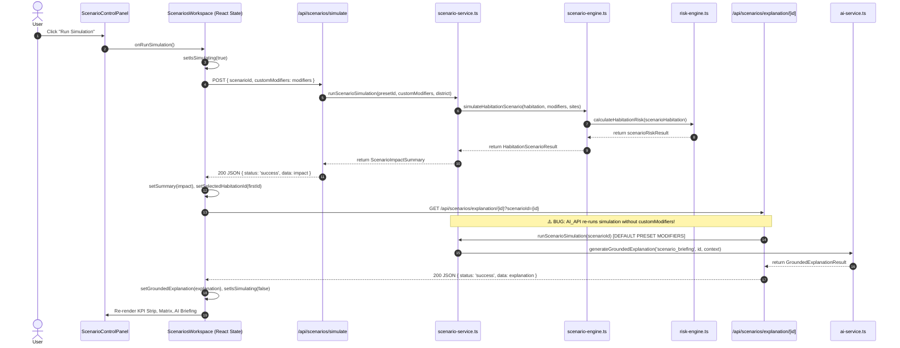

# SIH26191 Disaster Management Platform — Complete Technical Audit Report

**Date of Audit:** August 27, 2026  
**Audited Target:** Disaster Relocation Intelligence Platform (DRIP-SIH26191)  
**Scope:** Full codebase audit covering multi-hazard risk engine, carrying-capacity and suitability engines, climate scenario simulation pipeline, GIS spatial services, reports generation, and client-server synchronization.

---

## Table of Contents
1. [A. Current Architecture Overview](#a-current-architecture-overview)
2. [B. Comprehensive Calculation Inventory](#b-comprehensive-calculation-inventory)
3. [C. Run Simulation End-to-End Flow Trace](#c-run-simulation-end-to-end-flow-trace)
4. [D. Audit Findings & Inconsistencies](#d-audit-findings--inconsistencies)
5. [E. Severity Classification Matrix](#e-severity-classification-matrix)
6. [F. Exact Files, Components, and Functions Involved](#f-exact-files-components-and-functions-involved)
7. [G. Recommended Remediation & Architecture Hardening](#g-recommended-remediation--architecture-hardening)
8. [H. Test Suite & Verification Matrix](#h-test-suite--verification-matrix)

---

## A. Current Architecture Overview

The application is structured as a Next.js 16 (React 19, TypeScript 5.9, Tailwind CSS v4) decision-support system backed by Drizzle ORM and PostGIS-compatible schemas.

```
┌─────────────────────────────────────────────────────────────────────────────────────────────┐
│                                     PRESENTATION LAYER                                      │
├──────────────────┬──────────────────┬──────────────────┬──────────────────┬─────────────────┤
│    Dashboard     │   Habitations    │    Relocation    │    Scenarios     │     Reports     │
│  (Command Center)│ (Triage Queue)   │ (Capacity/Match) │ (Climate Stress) │ (Statutory Docs)│
└─────────┬────────┴─────────┬────────┴─────────┬────────┴─────────┬────────┴────────┬────────┘
          │                  │                  │                  │                 │
          ▼                  ▼                  ▼                  ▼                 ▼
┌─────────────────────────────────────────────────────────────────────────────────────────────┐
│                             SERVER ACTION & SERVICE LAYER                                   │
├──────────────────┬──────────────────┬──────────────────┬──────────────────┬─────────────────┤
│ command-center-  │   risk-service   │relocation-service│ scenario-service │ report-service  │
│    service.ts    │      .ts         │  & capacity-svc  │      .ts         │ & report-builder│
└─────────┬────────┴─────────┬────────┴─────────┬────────┴─────────┬────────┴────────┬────────┘
          │                  │                  │                  │                 │
          ▼                  ▼                  ▼                  ▼                 ▼
┌─────────────────────────────────────────────────────────────────────────────────────────────┐
│                             DETERMINISTIC CALCULATION ENGINES                               │
├────────────────────────────┬─────────────────────────────┬──────────────────────────────────┤
│        Risk Engine         │       Capacity Engine       │        Suitability Engine        │
│      (risk-engine.ts)      │    (capacity-engine.ts)     │      (suitability-engine.ts)     │
│  • 5-Factor Weighted Model │  • 9-Dimension Bottlenecks  │  • 10-Criteria Weighted Match    │
│  • Compound Multi-Hazard   │  • Occupancy Buffer (0.85)  │  • Proximity Decay Curve         │
│  • Statutory Triage Bands  │  • Effective Absorption     │  • Safety Gate Disqualification  │
└────────────────────────────┴──────────────┬──────────────┴──────────────────────────────────┘
                                            │
                                            ▼
┌─────────────────────────────────────────────────────────────────────────────────────────────┐
│                            PERSISTENCE & SPATIAL REPOSITORIES                               │
├────────────────────────────┬─────────────────────────────┬──────────────────────────────────┤
│    Habitations Repo        │      Relocation Sites       │      Red Zones & Spatial         │
│ (repositories/habitations) │(repositories/relocation-site│(repositories/red-zones, spatial) │
└────────────────────────────┴─────────────────────────────┴──────────────────────────────────┘
```

---

## B. Comprehensive Calculation Inventory

### 1. Multi-Hazard Compound Intensity Calculation
* **Location:** `src/server/risk/risk-engine.ts` (`calculateMultiHazardRisk`)
* **Formula:**
  $$H_{\text{multi}} = \min\left(100, H_{\text{primary}} + \sum_{k \in \text{secondary}} \beta \cdot H_{\text{sec}, k} \cdot \left(1 - \frac{H_{\text{primary}}}{100}\right)\right)$$
* **Parameters:**
  * $\beta = 0.35$ (`secondaryDampeningCoefficient`)
  * $H_{\text{sec}} = H_{\text{primary}} \times 0.85$ (co-hazard intensity assumption)
  * $\text{Multiplier} = \frac{H_{\text{multi}}}{\max(1, H_{\text{primary}})}$
* **Output:** `compoundScore` (rounded to 1 decimal), `multiplier` (rounded to 2 decimals).

### 2. Demographic Vulnerability Score Calculation
* **Location:** `src/server/risk/risk-engine.ts` (`calculateDemographicVulnerabilityScore`)
* **Formula:**
  $$\text{Raw Demographic Score} = \left(\frac{\text{BPL}}{\text{Pop}} \cdot 35\right) + \left(\frac{\text{Elderly}}{\text{Pop}} \cdot 25\right) + \left(\frac{\text{Children}}{\text{Pop}} \cdot 20\right) + \left(\min\left(1, \frac{\text{PWD} \cdot 3}{\text{Pop}}\right) \cdot 20\right)$$
  $$\text{Vulnerability Score} = \min\left(100, \text{Raw Demographic Score} \cdot 0.4 + \text{Base Survey Factor} \cdot 0.6\right)$$
* **Output:** Normalized index $[0, 100]$, rounded to 1 decimal.

### 3. Disaster Recurrence History Score Calculation
* **Location:** `src/server/risk/risk-engine.ts` (`calculateDisasterHistoryScore`)
* **Formula:**
  $$\text{Recency Weight}_i = \frac{1}{1 + (\text{Current Year} - \text{Event Year}_i) \cdot 0.1}$$
  $$\text{Event Severity}_i = \min(50, \text{Casualties} \cdot 2.5) + \min(30, \text{Displaced} \cdot 0.05) + 20$$
  $$\text{Calculated Score} = \min\left(100, \sum_i (\text{Event Severity}_i \cdot \text{Recency Weight}_i) + \min(20, \text{Events Count} \cdot 8)\right)$$
  $$\text{History Score} = \min(100, \text{Calculated Score} \cdot 0.6 + \text{Base Factor} \cdot 0.4)$$
* **Output:** Normalized index $[0, 100]$, rounded to 1 decimal.

### 4. Infrastructure Fragility Risk Score Calculation
* **Location:** `src/server/risk/risk-engine.ts` (`calculateInfrastructureRiskScore`)
* **Formula:**
  $$\text{Gap Score} = \sum \text{Deficit Points} \quad (\text{Road: } 30, \text{Health Sub-centre: } 25, \text{Piped Water: } 20, \text{Mobile: } 15, \text{Power: } 10)$$
  $$\text{Infrastructure Score} = \min(100, \text{Gap Score} \cdot 0.5 + \text{Base Factor} \cdot 0.5)$$
* **Output:** Normalized index $[0, 100]$, rounded to 1 decimal.

### 5. Terrain Exposure Score Calculation
* **Location:** `src/server/risk/risk-engine.ts` (`calculateExposureScore`)
* **Formula:**
  * $\text{Slope Score} \in \{95 (\ge 35^\circ), 80 (\ge 28^\circ), 60 (\ge 18^\circ), 40 (\ge 8^\circ), 30 (< 8^\circ)\}$
  * $\text{River Score} \in \{95 (\le 0.05\text{km}), 85 (\le 0.2\text{km}), 70 (\le 0.5\text{km}), 45 (\le 1.5\text{km}), 20 (> 1.5\text{km})\}$
  $$\text{Exposure Score} = \min(100, (\text{Slope Score} \cdot 0.6 + \text{River Score} \cdot 0.4) \cdot 0.5 + \text{Base Factor} \cdot 0.5)$$

### 6. Composite Multi-Hazard Risk Score & Factor Contributions
* **Location:** `src/server/risk/risk-engine.ts` (`calculateHabitationRisk`)
* **Weights:** Hazard (35%), Vulnerability (25%), History (20%), Exposure (10%), Infrastructure (10%).
* **Formula:**
  $$S_{\text{composite}} = \min\left(100, \max\left(0, \sum_{k \in \text{factors}} w_k \cdot S_k\right)\right)$$
* **Weighted Contributions:** $C_k = \text{round}(w_k \cdot S_k, 1)$.
* **Output:** $S_{\text{composite}}$ (rounded to 1 decimal).

### 7. Statutory Triage & Priority Urgency Classification
* **Location:** `src/server/risk/risk-engine.ts` (`calculateRelocationPriority`)
* **Rules:**
  1. **CRITICAL / Immediate (0–6 months):**
     $$S_{\text{composite}} \ge 85 \quad \lor \quad (\text{In Red Zone} \land S_{\text{composite}} \ge 80) \quad \lor \quad (\text{In Red Zone} \land S_{\text{hazard}} \ge 90 \land S_{\text{vuln}} \ge 80)$$
  2. **HIGH / Short-Term (6–18 months):**
     $$S_{\text{composite}} \ge 68 \quad \lor \quad (\text{In Red Zone} \land S_{\text{composite}} \ge 60)$$
  3. **MEDIUM / Medium-Term (18–36 months):**
     $$S_{\text{composite}} \ge 45$$
  4. **LOW / Monitoring (Surveillance):**
     $$S_{\text{composite}} < 45$$

### 8. Multi-Dimensional Carrying Capacity & Limiting Factor Engine
* **Location:** `src/server/capacity/capacity-engine.ts` (`calculateSiteCapacity`)
* **Dimensions Evaluated (Supported Population):**
  1. **Land:** $\text{areaHectares} \cdot 10000 / 50\text{ sq.m/person}$
  2. **Water:** $\text{nominalCapacity} \times \{1.15 \text{ (adequate)}, 0.80 \text{ (partial)}, 0.40 \text{ (inadequate)}\}$
  3. **Sanitation:** $\text{nominalCapacity} \times \{1.10 \text{ (power adequate \& water not inadequate)}, 0.75 \text{ (otherwise)}\}$
  4. **Shelter:** $\max(\text{nominalCapacity} \cdot 0.70, \text{shelterCapacity} > 0 ? \text{shelterCapacity} \cdot 1.80 : \text{nominalCapacity} \cdot 0.65)$
  5. **Healthcare:** $\text{nominalCapacity} \times \{1.20, 0.85, 0.45\}$
  6. **Road Access:** $\text{nominalCapacity} \times \{1.25, 0.80, 0.35\}$
  7. **Schools:** $\text{nominalCapacity} \times \{1.10, 0.80, 0.50\}$
  8. **Power:** $\text{nominalCapacity} \times \{1.20, 0.80, 0.40\}$
  9. **Livelihood:** $\text{nominalCapacity} \times \{1.15, 0.75, 0.40\}$
* **Limiting Factor Principle:**
  $$\text{Limiting Capacity} = \min_{d \in \text{dimensions}}(\text{Supported Population}_d)$$
  $$\text{Effective Capacity} = \text{round}(\text{Limiting Capacity} \cdot 0.85) \quad (\text{Occupancy Buffer } = 0.85)$$
  $$\text{Available Headroom} = \max(0, \text{Effective Capacity} - \text{Current Occupancy})$$
  $$\text{Utilization \%} = \min\left(100, \text{round}\left(\frac{\text{Current Occupancy}}{\text{Effective Capacity}} \cdot 100\right)\right)$$

### 9. 10-Criteria Site Suitability & Proximity Model
* **Location:** `src/server/relocation/suitability-engine.ts` (`evaluateSiteSuitability`)
* **Hard Safety Disqualification:** If $\text{site.hazardExposure} = \text{'critical'}$, $\text{Suitability Score} = 0$, $\text{Band} = \text{'UNSUITABLE'}$, $\text{Disqualified} = \text{true}$.
* **Weights:** Safety (25%), Capacity Headroom (20%), Distance (15%), Road (10%), Water (8%), Healthcare (7%), Shelter (5%), Power (4%), Livelihood (3%), Schools (3%).
* **Distance Scoring (Haversine WGS84):** $\le 10\text{km} \to 100$, $\le 20\text{km} \to 85$, $\le 35\text{km} \to 65$, $\le 50\text{km} \to 40$, $\le 100\text{km} \to 20$, $> 100\text{km} \to 0$.

### 10. Climate & Hazard Scenario Simulation Transformations
* **Location:** `src/server/scenarios/scenario-engine.ts` (`simulateHabitationScenario`)
* **Transformation Modifiers:**
  * **Landslide Hazard:** $S_{\text{hz, scenario}} = \text{clamp}(0, 100, \text{round}(S_{\text{hz, base}} \cdot M_{\text{rain}} \cdot M_{\text{slope}} + \text{Surge}_{\text{cloud}} \cdot 0.35))$
  * **Flood Hazard:** $S_{\text{hz, scenario}} = \text{clamp}(0, 100, \text{round}(S_{\text{hz, base}} \cdot M_{\text{rain}} \cdot M_{\text{flood}}))$
  * **Cloudburst Hazard:** $S_{\text{hz, scenario}} = \text{clamp}(0, 100, \text{round}(S_{\text{hz, base}} \cdot M_{\text{rain}} + \text{Surge}_{\text{cloud}} \cdot 1.20))$
  * **Coastal Erosion Hazard:** $S_{\text{hz, scenario}} = \text{clamp}(0, 100, \text{round}(S_{\text{hz, base}} \cdot M_{\text{flood}} \cdot (M_{\text{rain}} > 1 ? 1.08 : 1.0)))$
  * **Exposure Shift:** $S_{\text{expo, scenario}} = \text{clamp}\left(0, 100, \text{round}\left(S_{\text{expo, base}} \cdot \frac{M_{\text{slope}} + M_{\text{flood}}}{2}\right)\right)$
  * **Infrastructure Strain:** $S_{\text{infra, scenario}} = \text{clamp}(0, 100, \text{round}(S_{\text{infra, base}} \cdot M_{\text{infra}}))$
* **Delta Calculations:**
  $$\Delta_{\text{risk}} = \text{round}(S_{\text{comp, scenario}} - S_{\text{comp, base}}, 1)$$
  $$\%\text{ Change} = \text{round}\left(\frac{\Delta_{\text{risk}}}{S_{\text{comp, base}}} \cdot 100, 1\right)$$
  $$\Delta C_k = \text{round}(C_{k, \text{scenario}} - C_{k, \text{base}}, 2)$$

---

## C. Run Simulation End-to-End Flow Trace



### Trace Step-by-Step Breakdown:

1. **User Action:** User configures sliders (`rainfallMultiplier`, `cloudburstSurge`, `slopeSaturationFactor`, `infrastructureStrainMultiplier`) and clicks **Run Simulation**.
2. **Component Handler:** `ScenarioControlPanel` triggers `onRunSimulation()`, mapped to `handleRunSimulation` in `src/features/scenarios/components/scenarios-workspace.tsx`.
3. **HTTP Dispatch:** `fetch('/api/scenarios/simulate')` sends a JSON POST payload with `scenarioId` and `customModifiers`.
4. **Backend Orchestration:** `src/app/api/scenarios/simulate/route.ts` forwards to `runScenarioSimulation(...)` in `src/server/scenarios/scenario-service.ts`.
5. **Deterministic Execution:**
   - Fetches habitations, candidate sites, and capacity rollups.
   - For each habitation, runs `simulateHabitationScenario(...)` which constructs an immutable scenario-modified habitation object and passes it through `calculateHabitationRisk(...)` and `findRelocationCandidates(...)`.
   - Computes aggregations: `changedHabitations`, `newlyCriticalHabitations`, `newlyImmediateRelocations`, `capacityDeficit`, and `districtImpacts`.
6. **State Ingestion:** Response updates `summary` state in `ScenariosWorkspace`.
7. **AI Briefing Request:** Dispatches `GET /api/scenarios/explanation/${firstId}?scenarioId=${scenarioId}`.
8. **UI Rendering:** Updates `ScenarioImpactKpiStrip`, `ScenarioComparisonTable`, and `ScenarioExplanationPanel`.

---

## D. Audit Findings & Inconsistencies

### 1. Simulation & State Synchronization Issues

#### Problem 1.1: Reset Baseline Stale Closure Bug
* **File:** `src/features/scenarios/components/scenarios-workspace.tsx` (lines 82–85)
* **Code:**
  ```typescript
  const handleResetBaseline = () => {
    handlePresetChange(presets[0]!.id);
    handleRunSimulation();
  };
  ```
* **Failure Mode:** `handlePresetChange` schedules React state updates for `selectedPresetId` and `modifiers`. Because React state updates are asynchronous and batched, `handleRunSimulation()` executes immediately in the same event tick, reading the **stale** un-reset state from the closure. The API receives the old custom modifiers instead of the reset values.
* **Secondary Flaw:** `presets[0]` is `monsoon_rainfall_20` (+20% rainfall escalation), which is an escalated disaster preset, **not** a true baseline (which requires all multipliers = 1.0, surge = 0).

#### Problem 1.2: AI Grounded Explanation Ignores Custom Modifiers & Fallback Leak
* **File:** `src/app/api/scenarios/explanation/[habitationId]/route.ts` (lines 14–18)
* **Code:**
  ```typescript
  const impact = await runScenarioSimulation(scenarioId);
  const match = impact.changedHabitations.find(
    (h) => h.habitation.id === params.habitationId,
  ) ?? impact.changedHabitations[0];
  ```
* **Failure Mode:** The route calls `runScenarioSimulation(scenarioId)` with **default preset modifiers**, ignoring any custom slider adjustments the user tested. Furthermore, if a clicked habitation is not in `changedHabitations`, it silently falls back to `impact.changedHabitations[0]`, rendering an AI explanation for an entirely different village than the one selected.

#### Problem 1.3: Simulation State Isolation (Cross-Dashboard Desynchronization)
* **Files:** `src/app/(app)/dashboard/page.tsx`, `src/features/scenarios/components/scenarios-workspace.tsx`
* **Failure Mode:** Simulation results live strictly in ephemeral React state inside `ScenariosWorkspace`. Navigating to `/dashboard`, `/habitations`, `/relocation`, or `/map` displays baseline or hardcoded preset values. `/dashboard` unconditionally executes `runScenarioSimulation('monsoon_rainfall_20')` during SSR. There is no shared global store, cookie/session state, or URL state synchronizing the active simulation across modules.

---

### 2. Calculation & Aggregation Inconsistencies

#### Problem 2.1: Inverted Baseline vs Scenario Population at Risk Formula
* **File:** `src/server/scenarios/scenario-service.ts` (lines 75–83, 117, 125–127)
* **Code:**
  ```typescript
  const totalPopulationAtRiskBaseline = results.reduce((sum, r) => sum + r.habitation.population, 0);
  const totalPopulationAtRiskScenario = results
    .filter((r) => r.scenarioRisk.priority === 'CRITICAL' || r.scenarioRisk.priority === 'HIGH')
    .reduce((sum, r) => sum + r.habitation.population, 0);
  ```
* **Failure Mode:** Baseline population counts **all 7 habitations** (9,310 residents), whereas scenario population is filtered to **only Critical and High** tiers. Under a severe climate scenario, if 6 habitations are Critical/High totaling 8,530 residents, the system displays `totalPopulationAtRiskBaseline = 9,310` and `totalPopulationAtRiskScenario = 8,530`. The simulation reports a **reduction** in population at risk during disaster escalation.
* **District Rollup Inconsistency:** District breakdown replicates this exact flaw (`existing.populationAtRiskBaseline += r.habitation.population` vs filtered `existing.populationAtRiskScenario`).

#### Problem 2.2: Escalated Habitations Count Discrepancy between Summary and Districts
* **File:** `src/server/scenarios/scenario-service.ts` (lines 51–53, 122–124, 141)
* **Failure Mode:** `summary.totalHabitationsEscalated` equals `changedHabitations.length` (which includes settlements where $\Delta_{\text{risk}} > 0$ or candidate site changed, even if priority band did not escalate). In contrast, `districtImpacts[i].habitationsEscalated` only increments when `r.priorityTransition.hasEscalated === true`. The sum of district escalated counts does not equal the headline KPI card.

#### Problem 2.3: Divergent Relocation Headroom Formulas Across Pages
* **Files:** `src/server/capacity/capacity-engine.ts`, `src/server/gis/spatial-queries.ts`, `src/server/repositories/decision-summary.ts`, `src/features/gis/components/gis-feature-inspector.tsx`, `src/app/(app)/map/page.tsx`
* **Failure Mode:**
  * **Authoritative Engine (`capacity-engine.ts`):** Evaluates 9 infrastructure dimensions, identifies the limiting factor, applies an 85% safety buffer, and subtracts occupancy: $\text{Available Headroom} \approx 11,000$.
  * **GIS Inspector & Decision Summary (`spatial-queries.ts`, `decision-summary.ts`, `gis-feature-inspector.tsx`):** Computes $\text{Carrying Capacity} - \text{Occupancy} = 17,400 - 3,870 = 13,530$.
  * Result: `/map` header displays **13,530 available capacity**, while `/relocation` and `/dashboard` display **11,000+** available headroom for the exact same sites.

#### Problem 2.4: Rogue Heuristic Suitability Model in GIS Spatial Queries
* **File:** `src/server/gis/spatial-queries.ts` (`evaluateCandidateSites`, lines 51–89)
* **Failure Mode:** Bypasses `evaluateSiteSuitability` (`suitability-engine.ts`) and uses an uncalibrated formula:
  $$\text{Score} = \text{avgService} \cdot 0.6 + (\text{coveragePct} / 100) \cdot 40 - \text{hazardPenalty}$$
  It reads directly from raw fixture arrays. GIS Inspector displays candidate site scores and ranks that contradict the Relocation and Reports modules.

---

### 3. Data Flow, Dual-Source, and Persistence Problems

#### Problem 3.1: Dual Source of Truth for Habitation Priority and Timeline
* **Files:** `src/types/domain.ts`, `src/server/db/fixtures/disaster-data.ts`, `src/features/gis/components/gis-feature-inspector.tsx`, `src/features/gis/components/operational-gis-map.tsx`, `src/features/relocation/components/relocation-assessment-banner.tsx`, `src/features/reports/components/executive-summary-report-view.tsx`, `src/server/reports/report-builder.ts`
* **Failure Mode:** `Habitation` has static `priority` and `timeline` fields. When `calculateHabitationRisk(h)` runs, it produces a dynamic `assessment.priority` and `assessment.timeline`. Multiple components display `habitation.priority` (static DB field) instead of `assessment.priority` (engine evaluated). If parameters change or simulation is active, static views display stale priority bands.

#### Problem 3.2: GIS Workspace Hardcoded Fixture Coupling
* **File:** `src/features/gis/components/operational-gis-map.tsx` (lines 13–18, 131–136, 178–190)
* **Failure Mode:** Directly imports and renders static fixture arrays (`habitationsFixture`, `redZonesFixture`, `relocationSitesFixture`) on the client side. The map is completely decoupled from the PostgreSQL database, repository filters, risk calculations, and simulation deltas.

#### Problem 3.3: Incomplete Scenario CSV Export
* **File:** `src/server/reports/csv-export.ts` (line 210)
* **Failure Mode:** `generateScenarioImpactCsv` only iterates over `impact.changedHabitations`. Unchanged settlements are dropped from the CSV, creating an incomplete administrative record.

---

### 4. UI/UX and Component Flaws

#### Problem 4.1: Hardcoded Text and Metrics on Dashboard Overview
* **File:** `src/features/command-center/components/command-center-workspace.tsx` (lines 223, 228–236)
* **Failure Mode:** Static text proclaims "4 gazetted Red Zones" (fixture has 6), "4 sectors" (fixture has 7), and "10 facilities" (fixture has 4).
* **ID Substring Extraction:** `command-center-service.ts:89-99` determines districts by matching string prefixes (`WY`, `CH`, `RP`) instead of querying `site.district`.

#### Problem 4.2: Duplicate Habitation KPI Metrics
* **File:** `src/features/habitations/components/habitations-workspace.tsx` (lines 32–33)
* **Failure Mode:** `criticalHabitations` and `immediateRelocation` are both passed `rollup.priorityBreakdown.immediate`. Both cards display identical values despite different labels.

#### Problem 4.3: StatusPill Semantic Tone Rendering Bug
* **Files:** `src/features/scenarios/components/scenario-comparison-table.tsx` (line 112), `src/features/reports/components/executive-summary-report-view.tsx` (line 161)
* **Code:** `<StatusPill tone={r.scenarioRisk.priority === 'CRITICAL' ? 'critical' : 'high'}>`
* **Failure Mode:** If priority is `MEDIUM` or `LOW`, it is styled with `high` (amber/orange) styling instead of `moderate` or `neutral`.

#### Problem 4.4: Misleading Priority Habitations KPI Context
* **File:** `src/features/relocation/components/relocation-kpi-summary.tsx` (lines 58–65)
* **Failure Mode:** `totalHabitationsRequiringRelocation` is set to `plans.length` (all 7 habitations), labeling every surveyed habitation as "Priority Habitations in Relocation Queue".

---

## E. Severity Classification Matrix

| ID | Issue Description | Severity | Impact Area |
|---|---|---|---|
| **ISSUE-01** | Reset Baseline uses stale closure & non-baseline preset | **CRITICAL** | Simulation Engine / UX |
| **ISSUE-02** | AI Grounded Briefing ignores custom simulation modifiers & fallback leak | **CRITICAL** | AI Explainability / Scenarios |
| **ISSUE-03** | Inverted Baseline vs Scenario Population at Risk calculation | **CRITICAL** | Aggregation / Core Analytics |
| **ISSUE-04** | Dual headroom formulas between Capacity Engine and GIS/Repositories | **CRITICAL** | Carrying Capacity / Sizing |
| **ISSUE-05** | Rogue heuristic suitability model in `spatial-queries.ts` | **CRITICAL** | Relocation Matching / GIS |
| **ISSUE-06** | Dual source of truth for Habitation Priority (Static vs Engine) | **HIGH** | Triage / Reports / GIS |
| **ISSUE-07** | Escalated habitations count mismatch between Summary & Districts | **HIGH** | Scenario Aggregations |
| **ISSUE-08** | Scenario CSV export omits unchanged habitations | **HIGH** | Statutory Reporting / Export |
| **ISSUE-09** | Simulation state isolated from Dashboard, Habitations, and Map | **HIGH** | Application-wide State Sync |
| **ISSUE-10** | Hardcoded GIS summary numbers & ID substring parsing in Command Center | **MEDIUM** | Dashboard / GIS Inspection |
| **ISSUE-11** | Duplicate KPI card values in Habitations Workspace | **MEDIUM** | Habitations Triage UI |
| **ISSUE-12** | `StatusPill` tone fallback defaults Medium/Low to High | **MEDIUM** | Visual Semantic Tokens |
| **ISSUE-13** | GIS map decoupled from DB repository & dynamic engine calculations | **MEDIUM** | Spatial Layer Architecture |
| **ISSUE-14** | `totalHabitationsRequiringRelocation` counts all evaluated habitations | **MEDIUM** | Relocation Capacity KPI |
| **ISSUE-15** | Silent failures in simulation and report client fetch handlers | **LOW** | Client Error Handling |
| **ISSUE-16** | Scoring weights and magic numbers hardcoded inline in engine files | **LOW** | Config Centralization |

---

## F. Exact Files, Components, and Functions Involved

```
src/
├── config/
│   ├── capacity/default-model.ts                     [Authoritative Capacity Config]
│   └── risk/default-model.ts                         [Authoritative Risk Config]
├── server/
│   ├── risk/
│   │   ├── risk-engine.ts                           [calculateHabitationRisk, calculateRelocationPriority]
│   │   └── risk-service.ts                          [listHabitationRiskAssessments, getRegionalRiskRollup]
│   ├── capacity/
│   │   ├── capacity-engine.ts                       [calculateSiteCapacity (Limiting Factor Engine)]
│   │   └── capacity-service.ts                      [getRegionalCapacityRollup]
│   ├── relocation/
│   │   ├── matching-engine.ts                       [findRelocationCandidates]
│   │   ├── suitability-engine.ts                    [evaluateSiteSuitability]
│   │   └── relocation-service.ts                    [getRelocationKpiSummary, listAllRelocationPlans]
│   ├── scenarios/
│   │   ├── scenario-engine.ts                       [simulateHabitationScenario]
│   │   ├── scenario-service.ts                      [runScenarioSimulation]
│   │   └── scenario-config.ts                       [defaultScenarioModifiers, scenarioPresets]
│   ├── gis/
│   │   └── spatial-queries.ts                       [calculateDistanceKm, ⚠️ evaluateCandidateSites]
│   ├── command-center/
│   │   └── command-center-service.ts                [getCommandCenterData]
│   └── reports/
│       ├── report-builder.ts                        [buildExecutiveAuthoritySummary, buildGisAppendix]
│       └── csv-export.ts                            [generateScenarioImpactCsv, generateHabitationsPrioritizationCsv]
├── app/
│   └── api/
│       ├── scenarios/simulate/route.ts              [POST Simulation Handler]
│       ├── scenarios/explanation/[id]/route.ts      [⚠️ GET Explanation Handler]
│       └── reports/export/csv/route.ts              [CSV Export Route]
└── features/
    ├── scenarios/components/
    │   ├── scenarios-workspace.tsx                  [⚠️ handleResetBaseline, handleRunSimulation]
    │   ├── scenario-control-panel.tsx               [Modifiers Sliders & Preset Selector]
    │   ├── scenario-impact-kpi-strip.tsx            [Impact KPI Cards]
    │   ├── scenario-comparison-table.tsx            [⚠️ StatusPill Tone & Filter]
    │   └── scenario-explanation-panel.tsx           [AI Grounded Briefing Panel]
    ├── command-center/components/
    │   └── command-center-workspace.tsx             [⚠️ Hardcoded Counts & KPI Display]
    ├── habitations/components/
    │   ├── habitations-workspace.tsx                [⚠️ Duplicate KPI Props]
    │   ├── habitation-kpi-summary.tsx               [KPI Strip]
    │   └── habitation-prioritization-table.tsx      [Triage Table]
    ├── relocation/components/
    │   ├── relocation-workspace.tsx                 [Matching & Inventory Workspace]
    │   ├── relocation-kpi-summary.tsx               [⚠️ Total Relocation Queue KPI]
    │   └── relocation-assessment-banner.tsx         [Relocation Banner]
    └── gis/components/
        ├── operational-gis-map.tsx                  [⚠️ Direct Fixture Imports]
        └── gis-feature-inspector.tsx                [⚠️ Raw Headroom & Rogue Suitability]
```

---

## G. Recommended Remediation & Architecture Hardening

### Phase 1: Engine Alignment & Single Source of Truth
1. **Unify Headroom Calculation:** Deprecate raw `carryingCapacity - currentOccupancy` formulas across `spatial-queries.ts`, `decision-summary.ts`, and `gis-feature-inspector.tsx`. All surfaces must call `calculateSiteCapacity(site).availableHeadroom`.
2. **Deprecate Rogue Suitability in GIS:** Replace `evaluateCandidateSites` in `spatial-queries.ts` with `findRelocationCandidates` from `src/server/relocation/matching-engine.ts`.
3. **Harmonize Priority / Timeline Data Source:** Ensure all UI components and exporters read `assessment.priority` and `assessment.timeline` derived from `calculateHabitationRisk(h)`.

### Phase 2: Simulation Pipeline & Aggregation Repair
1. **Fix Reset Baseline:**
   * Create a dedicated `BASELINE_MODIFIERS` constant (`rainfallMultiplier: 1.0`, `cloudburstSurge: 0`, etc.).
   * Refactor `handleResetBaseline` in `ScenariosWorkspace` to pass explicit baseline modifiers directly into `handleRunSimulation(explicitModifiers)`.
2. **Synchronize AI Grounded Explanation with Custom Modifiers:**
   * Update `/api/scenarios/explanation/[habitationId]` to accept POST requests with `customModifiers` or pass query params for modifiers.
   * Fix fallback logic so explanations strictly target the requested habitation.
3. **Correct Population at Risk & Delta Formulas:**
   * Standardize:
     $$\text{Baseline High Risk Pop} = \sum_{\text{priority} \in \{\text{CRITICAL}, \text{HIGH}\}} \text{Pop}_{\text{baseline}}$$
     $$\text{Scenario High Risk Pop} = \sum_{\text{priority} \in \{\text{CRITICAL}, \text{HIGH}\}} \text{Pop}_{\text{scenario}}$$
     $$\Delta \text{ Pop at Risk} = \text{Scenario High Risk Pop} - \text{Baseline High Risk Pop}$$
4. **Harmonize District Rollup Counts:** Align `summary.totalHabitationsEscalated` with the sum of `districtImpacts.habitationsEscalated` by using consistent escalation definitions.
5. **Complete Scenario CSV Export:** Ensure `generateScenarioImpactCsv` exports all habitations evaluated in the simulation.

### Phase 3: UI/UX & State Synchronization
1. **Fix Hardcoded Dashboard Text & District Parsing:** Compute Red Zone, Site, and Infrastructure counts dynamically from repositories.
2. **Correct Semantic StatusPills:** Implement a helper function `getPriorityTone(priority: PriorityLevel): SemanticTone` returning `critical` for CRITICAL, `high` for HIGH, `moderate` for MEDIUM, and `neutral` for LOW.
3. **Deduplicate Habitation KPI Strip:** Pass distinct metrics for Critical Count (score $\ge 80$ or Red Zone trigger) and Immediate Relocation Count.
4. **Client State Resilience:** Add error banners and retry states when simulation API requests fail.

---

## H. Test Suite & Verification Matrix

The following test suites must be created or updated to guarantee complete mathematical consistency:

| Test Suite | File Path | Scope / Invariants Verified |
|---|---|---|
| **Simulation Modifiers Test** | `tests/unit/scenario-engine-modifiers.test.ts` | Verify that each slider (Rainfall, Cloudburst, Saturation, Infra Strain) produces deterministic, non-zero deltas across all 5 hazard types. |
| **Reset Baseline Test** | `tests/unit/scenario-reset-baseline.test.ts` | Verify that Reset Baseline restores exact baseline scores ($\Delta_{\text{risk}} = 0$, $0$ escalated habitations). |
| **Population at Risk Invariant Test** | `tests/unit/scenario-population-invariants.test.ts` | Verify $\text{Scenario Pop at Risk} \ge \text{Baseline Pop at Risk}$ under stress presets. |
| **Single Headroom Source Test** | `tests/unit/capacity-headroom-unification.test.ts` | Verify GIS inspector, Command Center, Relocation page, and Reports produce identical headroom for every candidate site. |
| **AI Explanation Grounding Test** | `tests/unit/ai-grounded-simulation.test.ts` | Verify AI briefing reflects custom simulation modifiers and does not fall back to an unrelated habitation. |
| **District Sum Integrity Test** | `tests/unit/scenario-district-rollup.test.ts` | Verify $\sum \text{District Escalated} = \text{Total Escalated}$ and $\sum \text{District Evaluated} = \text{Total Evaluated}$. |
| **CSV Full Export Test** | `tests/unit/csv-export-integrity.test.ts` | Verify Scenario CSV contains all habitations, not just changed rows. |

---
*Report compiled autonomously by Antigravity Technical Audit Engine for SIH26191.*
